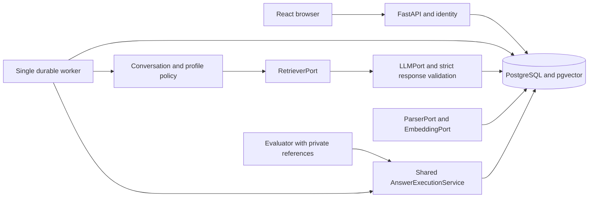
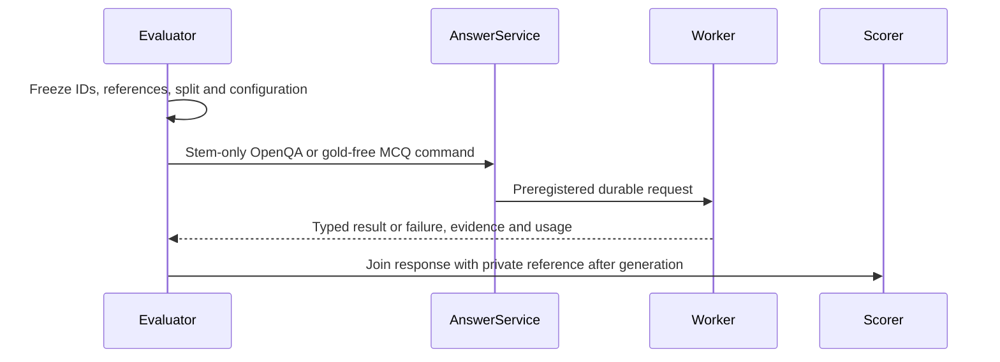

# Implemented application architecture

[SPEC.md](../../SPEC.md) is the implementation entry point; [PRD.md](../../PRD.md) defines product scope and [PLANS.md](../../PLANS.md) records the complete task status. This is one modular application with a React browser, FastAPI process, one durable worker and PostgreSQL 16/pgvector. The optional evaluator shares answer execution through gold-free commands; its private references are absent from API/worker runtime images and mounts. English free-text chat is primary; E0 is no retrieval and E1 is frozen R0 dense retrieval.

The original full-system diagram is Figure 1 on page 1 of `E:/5703/development_inputs/sources/COMP5703/CS30-1_Project_Framework_and_Delivery_Workflow.pdf`; the original baseline in that source directory is the unpaginated `tut5/xianshu/architecture-en-preview.png`. The source directory is adjacent to the application checkout. Exact source/module/connection mapping, current hash confirmation and the retained visual inspection are in [source-architecture-audit.md](../execution/source-architecture-audit.md). The following diagrams are current architectural summaries, not original figures or declarations of actual class names.



The active replacement boundaries are concrete functions/adapters below. API routes own authentication/input validation; domain services own transactions and lifecycle rules. Original identity/session modules, initial migration, error envelopes and hashing are retained and adapted with provenance.

| Architectural concept | Actual active implementation |
| --- | --- |
| Parser boundary | `pipelines/parse.py:parse(path, media_type)`, called by knowledge `execute_processing`; PDF/TXT dispatch |
| Cleaning/chunking | `pipelines/clean.py:clean_source_text`, `pipelines/chunk.py:chunks`, `pipelines/reports.py`; source units, issues and spans persisted by knowledge service |
| Embedding boundary | `retrieval/embedding.py:make_embedding`, `MockEmbedding`, `E5Embedding`; shared release/query configuration |
| Retrieval boundary | `backend/app/modules/knowledge/service.py:retrieve(db, query, release_id, variant, top_k)`; R0 pgvector, R1 `ranking.bm25`, R2 `ranking.rrf`, R3 `CrossEncoderReranker` |
| Context/query preparation | `conversation/context.py:select_context`, `summary.py:summarize`, `query.py:prepare_query` |
| Profile compiler | `personalisation/compiler.py:compile_profile`; rules and temporary turn override frozen in `snapshots` |
| Language-model boundary | `generation/adapters.py:LLMAdapter.generate` and `types.py:ModelConfig`, invoked by `GenerationService` |
| Provider wire protocols | `generation/providers.py`; OpenAI-compatible/Azure/Ollama Chat Completions, native Anthropic Messages and Gemini generateContent |
| Model settings | `backend/app/modules/model_settings/`; workspace revisions, encrypted credential references, actual connection tests and compare-and-set activation |
| Token accounting | `generation/token_counting.py`; local pinned tokenizers, explicit estimates and provider count calls sharing the request budget |
| Failure diagnostics | `backend/app/modules/answering/diagnostics.py`; selected workspace-scoped question/stage/error/count fields, excluding raw provider prompts and credentials |
| Prompt and response policy | `generation/prompt_builder.py:build_messages`, versioned prompts, `parser.py:parse_response` |
| Shared answer execution | `backend/app/modules/answering/service.py:submit_chat` and `execute_answer`, invoked by routes/worker; there is no implemented class named `AnswerExecutionService` |
| Evaluator bridge | Experiment `bridge.py:DatabaseAnswerBackend`, `create_backend`, `register_manifest`, `submit_item`; creates the same AnswerRequest/Job rows consumed by `execute_answer` |
| Independent teaching | Experiment `execute_teaching` plus `personalisation/study.py:TeachingStudyService`; separate stored study records/budgets, no learner-message mutation |
| Worker and operations | `backend/app/worker.py`, `cli.py`, `operations.py`, `scripts/release/{backup,restore}.py` |

`backend/app/platform_core/ports.py` retains historical ParserPort/RetrieverPort/GeneratorPort Protocols. They are compatibility/design assets; the current pipeline does not thereby become a consumer of their old registry signatures. EmbeddingPort, LLMPort and ProfileCompiler in earlier design text are conceptual names, with actual implementations identified above. No separate hidden answer engine is implied by mode-specific submission adapters.

```mermaid
sequenceDiagram
  participant Browser
  participant API
  participant Database
  participant Worker
  participant Model
  Browser->>API: POST message with idempotency key
  API->>Database: Lock session; save user message, snapshots, request, job
  API-->>Browser: 202 request and job identities
  Worker->>Database: Claim queued job and execution token
  Worker->>Worker: Prepare query, retrieve, budget current evidence
  Worker->>Model: Role-separated messages and current evidence
  Model-->>Worker: Structured response or explicit failure
  Worker->>Database: Recheck token and availability; atomic publication
  Browser->>API: Poll job then read server message history
  API-->>Browser: Saved response, evidence and applied profile
```



One active answer job per session prevents ordering ambiguity. Slow embedding/reranking/provider work must release job locks so Stop can finish. Worker claim/publication tokens prevent stale or cancelled execution from publishing. Crash recovery records uncertain calls and retains budgets; it does not promise exactly-once external execution. PostgreSQL is required for vector/locking acceptance; the inherited SQLite fallback is not a full-product deployment. Missing live configuration fails explicitly, and missing SciQ never changes chat readiness.

`compose.yaml` is the release path: frontend serves one built application, API/worker share source storage/runtime configuration, and only the evaluator receives private reference/run mounts. Startup is database health, migrations, explicit development seed, then API/worker/frontend. A failed corpus build preserves the active pointer. Backup/restore uses a distinct database and empty source target; exact implemented commands are in [runbook.md](../runbook.md).

All four required official books—Biology 2e, Chemistry 2e, Anatomy & Physiology 2e and Concepts of Biology—have actual source processing and a published 10,594-vector real E5 release. The per-book report records exact coverage and remaining visual/semantic limits. Retired College Physics is excluded; SciQ/support remains evaluator-only. The 13 September upgrade rechecks corpus integrity and connects actual DeepSeek answering, with failed attempts and scoped reviews retained. Historical authored/mock tests remain distinct from these real flows. The canonical ledgers and upgrade record link current results.
