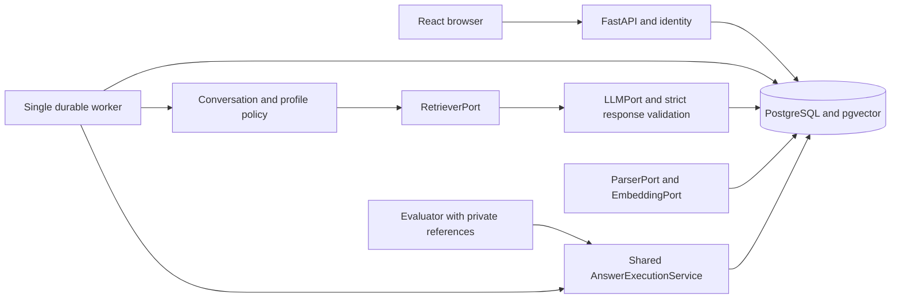
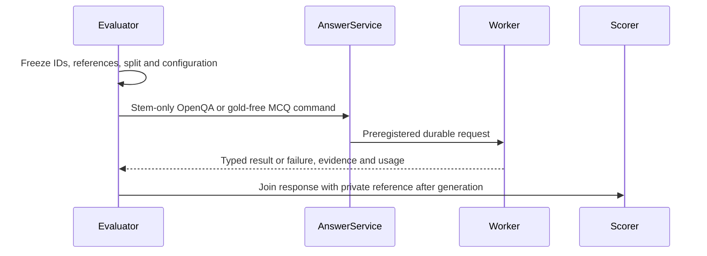

# Implemented application architecture

[SPEC.md](../../SPEC.md) is the implementation entry point; [PRD.md](../../PRD.md) defines product scope and [PLANS.md](../../PLANS.md) records the complete task status. This is one modular application with a React browser, FastAPI process, one durable worker and PostgreSQL 16/pgvector. The optional evaluator shares answer execution through gold-free commands; its private references are absent from API/worker runtime images and mounts. English free-text chat is primary; E0 is no retrieval and E1 is frozen R0 dense retrieval.

The original full-system diagram is Figure 1 on page 1 of `E:/5703/development_inputs/sources/COMP5703/CS30-1_Project_Framework_and_Delivery_Workflow.pdf`; the original baseline in that source directory is the unpaginated `tut5/xianshu/architecture-en-preview.png`. The source directory is adjacent to the application checkout. Exact source/module/connection mapping, current hash confirmation and the retained visual inspection are in [source-architecture-audit.md](../execution/source-architecture-audit.md). The following diagrams are current architectural summaries, not original figures or declarations of actual class names.



The active replacement boundaries are concrete functions/adapters below. API routes own authentication/input validation; domain services own transactions and lifecycle rules. Original identity/session modules, initial migration, error envelopes and hashing are retained and adapted with provenance.

| Architectural concept | Actual active implementation |
| --- | --- |
| Parser boundary | `pipelines/parse.py:parse(path, media_type)`, called by knowledge `execute_processing`; PDF/TXT dispatch |
| Cleaning/chunking | `pipelines/clean.py:clean_source_text`, `pipelines/chunk.py:chunks`, `pipelines/reports.py`; source units, issues and spans persisted by knowledge service |
| Embedding boundary | `retrieval/embedding.py:make_embedding`, `MockEmbedding`, `E5Embedding`; shared immutable model/tokenizer/preprocessing identity; separate optional query execution device since 16 September |
| Retrieval boundary | `backend/app/modules/knowledge/service.py:retrieve(db, query, release_id, variant, top_k, runtime_device=...)`; R0 pgvector, R1 `ranking.bm25`, R2 `ranking.rrf`, R3 `CrossEncoderReranker`; interactive-only frozen relevance screen in `retrieval/relevance.py` |
| Context/query preparation | `conversation/context.py:select_context`, `summary.py:summarize`, `query.py:prepare_query`, `understanding.py` bounded learner-context alias/correction rules |
| Profile compiler | `personalisation/compiler.py:compile_profile`; rules and temporary turn override frozen in `snapshots` |
| Language-model boundary | `generation/adapters.py:LLMAdapter.generate` and `types.py:ModelConfig`, invoked by `GenerationService` |
| Provider wire protocols | `generation/providers.py` and `generation/capabilities.py`; explicit versioned Chat Completions/Responses, Azure/Ollama-compatible, Anthropic Messages and Gemini generateContent capabilities |
| Model settings | `backend/app/modules/model_settings/`; workspace revisions, encrypted credential references, role-specific basic/structured/project probes and compare-and-set answer/checker activation |
| Token accounting | `generation/token_counting.py`; local pinned tokenizers, explicit estimates and provider count calls sharing the request budget |
| Failure diagnostics | `backend/app/modules/answering/diagnostics.py`; selected workspace-scoped question/stage/error/count fields, excluding raw provider prompts and credentials |
| Prompt and response policy | `generation/prompt_builder.py:build_messages`, versioned prompts, `parser.py:parse_response` |
| Shared answer execution | `backend/app/modules/answering/service.py:submit_chat` and `execute_answer`, invoked by routes/worker; there is no implemented class named `AnswerExecutionService` |
| Evaluator bridge | Experiment `bridge.py:DatabaseAnswerBackend`, `create_backend`, `register_manifest`, `submit_item`; creates the same AnswerRequest/Job rows consumed by `execute_answer` |
| Independent teaching | Experiment `execute_teaching` plus `personalisation/study.py:TeachingStudyService`; separate stored study records/budgets, no learner-message mutation |
| Worker and operations | `backend/app/worker.py`, `cli.py`, `operations.py`, `scripts/release/{backup,restore}.py` |

`backend/app/platform_core/ports.py` retains historical ParserPort/RetrieverPort/GeneratorPort Protocols. They are compatibility/design assets; the current pipeline does not thereby become a consumer of their old registry signatures. EmbeddingPort, LLMPort and ProfileCompiler in earlier design text are conceptual names, with actual implementations identified above. No separate hidden answer engine is implied by mode-specific submission adapters.

```mermaid
sequenceDiagram
  participant Browser
  participant API
  participant Database
  participant Worker
  participant Model
  Browser->>API: POST message with idempotency key
  API->>Database: Lock session; save user message, snapshots, request, job
  API-->>Browser: 202 request and job identities
  Worker->>Database: Claim queued job and execution token
  Worker->>Worker: Prepare query, retrieve, budget current evidence
  Worker->>Model: Role-separated messages and current evidence
  Model-->>Worker: Structured response or explicit failure
  Worker->>Database: Recheck token and availability; atomic publication
  Browser->>API: Poll job then read server message history
  API-->>Browser: Saved response, evidence and applied profile
```



One active answer job per session prevents ordering ambiguity. Slow embedding/reranking/provider work must release job locks so Stop can finish. Worker claim/publication tokens prevent stale or cancelled execution from publishing. Crash recovery records uncertain calls and retains budgets; it does not promise exactly-once external execution. PostgreSQL is required for vector/locking acceptance; the inherited SQLite fallback is not a full-product deployment. Missing live configuration fails explicitly, and missing SciQ never changes chat readiness.

`compose.yaml` is the release path: frontend serves one built application, API/worker share source storage/runtime configuration, and only the evaluator receives private reference/run mounts. Startup is database health, migrations, explicit development seed, then API/worker/frontend. A failed corpus build preserves the active pointer. Backup/restore uses a distinct database and empty source target; exact implemented commands are in [runbook.md](../runbook.md).

All four required official books—Biology 2e, Chemistry 2e, Anatomy & Physiology 2e and Concepts of Biology—have actual source processing and a published 10,594-vector real E5 release. The per-book report records exact coverage and remaining visual/semantic limits. Retired College Physics is excluded; SciQ/support remains evaluator-only. The 13 September upgrade rechecks corpus integrity and connects actual DeepSeek answering, with failed attempts and scoped reviews retained. Historical authored/mock tests remain distinct from these real flows. The canonical ledgers and upgrade record link current results.

## 16 September integrated understanding, evidence and trace (retained baseline)

The existing modular flow now connects versioned deterministic understanding → current-query retrieval/prior-evidence union → fixed-reranker relevance screen → complementary whole-passage packing → teaching/grounding prompt → structural validation and citation review flags → atomic persistence. The backend freezes query/device/selection/relevance policies, persists safe observations, and exposes an administrator allowlist projection. This remains one answer service and one worker, with no extra answering engine or hidden understanding call.

The corpus configuration, embedding signature and 10,594 vectors are unchanged. New interactive requests use a separate execution-device policy. Legacy commands retain v6/recorded selection paths; formal E0/E1 retains its original protocol. Textbook grounding remains default and explicit general knowledge has separate unverified provenance and never activates automatically. The [Week 8 record](../execution/week08-delivery-20260916.md) separates implemented lexical/control mechanisms, actual evidence and unperformed independent semantic/learning/device judgments.


## 20 September learning-state and checked publication

The existing answer service now freezes server-owned task/memory/checker context before queuing interactive work. `learning_state/tasks.py` owns problem continuity, explicit hint progression and disclosure snapshots; `learning_state/memory.py` owns opt-in entries, versioned changes, revocation and separate finite extraction jobs; `learning_state/sources.py` verifies immutable source mappings and applies one learner presentation across every read surface. `personalisation/memory.py` uses the shared provider adapter with its own two-call/90-second extraction budget. The single durable worker dispatches that purpose; it is not a second answer engine.

`generation/checked.py` consumes the frozen enhancement contract and uses generation → batch check → optional repair → required recheck within the existing four-call/180-second answer budget. Checker and generator configurations are recorded separately, including the larger explicit checker output reservation. `retrieval/source_spans.py` maps only actual submitted evidence into exact immutable cleaned-unit spans, retaining coarse/atomic-block limits. No corpus rebuild or fabricated PDF coordinates are required. Pure generation returns private drafts/checks plus a controlled public proposal; backend structural checks, current source visibility, memory epoch, task exposure epoch and the worker publication token jointly fence the commit.

The HTTP task resolver separately freezes `learning_task_v2`: explicit navigation preserves a problem, while a newly named problem starts a direct task. This post-regression lifecycle correction does not change the pure GenerationService formal study. Current default commands use conversation preparer v10, while explicit v6–v9 commands preserve historical behavior. The enhancement is activated only by its new frozen version; E0/E1 retains its existing protocol. New direct mock output is structurally attributable but semantically unverified. Hint T2 requires a real checker and cannot silently become T0. All actual/human quality judgments remain separate from typed schema and software tests.

[Persistence rules](data_model.md#20-september-learning-state-extension), [learning APIs](api_contract.md#20-september-controlled-learning-apis) and the [frozen protocol](../execution/week08-enhancement-protocol-20260920.md) describe the concrete boundaries. The main additive migration retained all 33 original tables and the 10,594-vector corpus, as verified by aggregate before/after fingerprints. Earlier September studies and publication snapshots remain dated evidence of their original runtime.

## 21 September integrated reliability and learner state

New chat commands freeze conversation preparer v11, `evidence_reliability_v2`, complementary complete generation context and cause-specific repair. `generation/checked_legacy.py` preserves the previous checked implementation for existing frozen commands and the B1 research condition. Exact spans still map to the same published corpus; generation context and visible highlights have independent sizes. The checker associates a claim's own markers with the exact supporting source, separates givens and arithmetic derivations, and distinguishes inconsistent checker metadata from failed factual support. All stages share the existing four-call/180-second answer budget.

`personalisation/memory_v2.py` performs typed field normalization, scope/topic resolution and current-question selection. `learning_state/memory_v2.py` owns ordered write events and transactional version changes. Submission applies recognized explicit corrections before freezing the request's attributable learner state; eligible unresolved extraction uses the existing worker. Current instructions override scoped explicit preferences, which override global presentation defaults in that subject. Memory preparation failure has an observable optional-stage status; revoked source/task/account access remains a publication barrier. Memory cannot change textbook facts, source access or teaching disclosure.

Provider capabilities choose wire parameters explicitly. Role-specific compatibility runs preserve each started/finished stage; answer and checker tests bind exact immutable configurations. Activation requires current project-contract evidence for both roles, with a separately selectable checker. Provider faults carry bounded transport identifiers into the administrator projection. Its memory status exposes readiness and a code while memory content remains within owner-controlled records.

The additive migration sequence is `c8d42e5a901f` → `d9e53f6b012a` → `e0a64c7d123b`. [Preservation evidence](../../evidence/week08-memory-v2/20260921/migration/preservation-result.json) verifies unchanged original-column hashes/counts for all 44 pre-existing tables. The [current execution record](../execution/week08-memory-v2-20260921.md) separates software, real runtime, formal studies and independent human review.

The three retained learner modules remain integrated: exact claim-linked source inspection, owner-controlled updatable memory, and persistent hint progression with explicit full explanation/source requests. Ordinary textbook questions default to direct complete answers. The [terminal study record](../execution/memory-v2-results-20260921.md) and [current implementation record](../execution/week08-memory-v2-20260921.md) distinguish the archived 485-file experimental version from the later 487-file software-gate snapshot, which includes the public-fixture test successor and the later packager/resource regression correction. No model, runtime, source-map or evaluator behavior changed in that successor.
