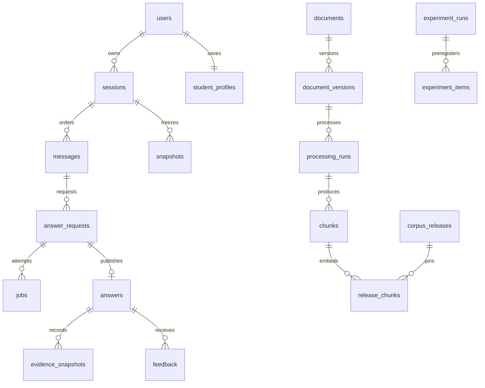

# Implemented persistence and transaction rules

This describes actual SQLAlchemy models and migrations, not additional proposed tables. [SPEC.md](../../SPEC.md) is the implementation entry point. The schema authority is `backend/alembic/versions/` and the models imported by `backend/app/db/models.py`. Retained migration `0001_initial` is extended by `3ae1ba39fe7f`, `a410a277e3a6`, `79f9729b3eae` and the additive model-settings migration `b6f924d031ae`. The [13 September upgrade record](../execution/answering_upgrade_20260913.md) supplements the original task registries and retains the earlier evidence boundary.

Most records inherit UUID-string `id`, UTC timestamps and integer `version`. Services explicitly increment revisions; SQLAlchemy does not automatically enforce optimistic locking on every table. `roles` has an integer key, `active_corpus` uses application singleton key `1`, and `release_chunks` has a composite primary key. Snapshot/output immutability is an application lifecycle rule, not a universal database trigger.

| Actual table / representation | Fields and relationships | Database constraints and application rules |
| --- | --- | --- |
| users, roles, workspaces | Role/workspace FKs, email, password hash, active/deactivated status; token_version integer | Unique indexed user email; unique role name/workspace slug; credential revocation and race-safe duplicate email conflict |
| student_profiles | Unique user FK, string level/style/language, topics JSON, audit version | API value validation and explicit optimistic revision; compiler version is a separate string in snapshot payload |
| snapshots | owner/session FKs, kind, payload JSON, content_hash | Both profile and conversation records use this table. Profile payload freezes rules/revision/turn override; conversation payload freezes messages/summary/cutoff/token report. Requests reference exact immutable snapshots. |
| sessions | user/workspace FKs, title, active/archived, deleted_at | There is no next_sequence column. Under the session lock, the service derives the next sequence from actual stored messages. |
| messages | session FK, sequence, user/assistant role, content, state, nullable active_answer_id/request_id strings | Unique(session_id,sequence), role check; active_answer_id/request_id are application-managed strings rather than declared FKs on this table |
| session_summaries | session FK, covered_until_sequence, source IDs, text/hash/method/tokens, invalidated flag | Prefix only, no overlap with recent history; revision change invalidates |
| documents | title, edition, source_url, licence text, active/revoked flags, owner FK | Deactivation blocks future retrieval; revocation also hides retained passages. There is no separate provenance/permission table. |
| document_versions | document FK, raw_hash, media_type, size_bytes, storage_path, original_filename | Unique raw_hash; immutable original bytes. New ingestion uses root-relative storage; restore can record absolute paths inside its distinct target root. |
| processing_runs | document_version FK, config_hash, configuration JSON, state, counts/error JSON | Unique(document_version_id,config_hash); exclusions live in configuration; changed rules create a new run |
| source_units | processing FK, sequence, physical page, section, raw_text/cleaned_text, quality, issues JSON | Quality issues are source_units.issues, not a separate quality_issues table. Quality exports compute raw/clean hashes and reconcile counts. |
| chunks | processing/document FKs, text/hash/tokens, section, pages JSON and spans JSON | Source spans are chunks.spans, not a spans table. Stable identity and source ranges are service-validated. |
| corpus_releases | name/state, configuration JSON, manifest JSON, error JSON | Manifest pins exact processing runs/counts/hashes; there is no release_assets table |
| release_chunks | release/chunk FKs forming a composite PK; embedding pgvector, dimension, model_revision | Actual vectors live in release_chunks.embedding, not an embeddings table. Dimension/finiteness/completeness/hash compatibility is release-service validation, not an undeclared SQL CHECK. |
| active_corpus | integer ID and nullable release FK | Application uses row 1 as its pointer; activation validates before switching atomically |
| configurations | kind, name, values JSON, content_hash | Unique content_hash; exposed service keeps canonical values immutable and secret-free |
| model_credentials | UUID, workspace FK, Fernet ciphertext, UTC creation time | Separate from public settings. No read API returns ciphertext or plaintext. Original credential rows remain available to earlier frozen model versions. |
| model_configurations | UUID, workspace FK, group_id/revision, previous-version FK, name/preset, public_config JSON/hash, nullable credential FK, creator FK/time | Unique(group_id,revision). Save creates a new row; stale successor requests return409. ORM update/delete guards and service lifecycle enforce immutability; these are not universal SQL triggers. |
| model_connection_tests | Configuration FK, passed/failed status, safe diagnostic code/message, latency, whitelisted numeric usage, tester FK/time | Append-only one-call probe results for the exact immutable configuration and credential reference. No raw provider response, HTTP headers or credential values. Mock checks are explicitly distinguishable from live transport probes. |
| active_model_configurations | Workspace FK primary key, nullable model-configuration FK, integer version | One pointer per workspace. Locked compare-and-swap checks expected_active_version; null means explicit environment-compatible operation. |
| model_activations | Workspace, previous/new configuration FKs, test FK, active revision, actor FK/time | Append-only switch audit. Database-model activation requires the latest passing probe for that exact version; explicit environment reversion is a separate recorded action. |
| answer_requests | owner/session/message/snapshot/release/config FKs; route/key/body_hash, mode/schema/state; regeneration_of/run_id/item_id strings; command/budget/trace JSON | Unique(owner_id,route,idempotency_key). Regeneration/run/item strings are application-managed, not all declared FKs. Budget persists configured maxima and consumption. |
| jobs | nullable request FK, owner FK, kind/payload/state/stage, execution token, worker identity, error JSON, answer_id string, attempt count | State CHECK queued/running/retry_wait/succeeded/failed/cancelled. Processing/release/teaching jobs may have no answer request. answer_id is application-managed. |
| attempts | job FK, sequence, payload JSON | Payload records phase/provider/usage/error events; no separate provider-attempt table |
| answers | unique request FK, job/message FKs, response_schema, response JSON, model_mode, timing JSON | One answer per logical request; regeneration publishes a different request/answer |
| evidence_snapshots | answer/document FKs, local evidence_id, chunk_id string, exact provenance/text payload | Unique(answer_id,evidence_id), not request_id. No chunk FK repoints historical content. |
| citations | answer FK, evidence_id FK to evidence_snapshots.id | The FK identifies the snapshot row; the visible ev_001 label lives on that Evidence record. Unique(answer_id,evidence_id). |
| feedback | answer/owner FKs, helpful/comment, review_state/review_note/issue | Unique(answer_id,owner_id). First save locks the existing answer; subsequent edits/reviews lock feedback. Regeneration never moves feedback. |
| experiment_runs | owner/config FKs, protocol/mode/condition/state/count, spec/manifest/hash and environment_change | Positive scheduled-count and state checks; only safe public commands/hashes, never answer keys/support |
| experiment_items | run FK, item_id/ordinal/question_id, command/hash, unique optional request FK, state/scores/scoring_evidence JSON | Unique(run_id,item_id) and unique(run_id,ordinal); all terminal outcomes retained on resume |
| teaching_study_records | run/owner/base-answer FKs, item_id, C0–C2, target level, frozen_inputs/hash, state/response/error/budget JSON | Unique(run_id,item_id), condition/level checks. One physical table for study input/output; no teaching_items/teaching_outputs tables. |
| outbox_events | retained modular-backend event records | Identity/session event evidence; not a broker prerequisite for chat |

The model configuration's public JSON contains protocol, model, base URL, context/output/time limits, structured-output mode and optional tokenizer/protocol settings. `answer_requests.command.model_config.configuration_id` freezes `model-settings:<UUID>`; it is an application reference inside the existing JSON command, not a new answer-request FK column. Workers use that immutable row's encrypted credential reference. Activating another version or replacing a key creates new records and cannot repoint a queued request, retry or historical answer. Missing managed records or decryption keys fail explicitly. Legacy environment configuration remains available when no managed pointer is selected.

Fernet uses `MODEL_CONFIG_ENCRYPTION_KEY` or `MODEL_CONFIG_KEY_FILE`, separate from the database and JWT secret. The default development path is `.secrets/model-config.key`; local bootstrap publishes it atomically and restricts its file permissions before writing secret bytes. Production does not generate a missing key. API and worker require the same deployment key. Portable source packages exclude that key and existing private history; restoring encrypted credentials requires the original deployment key through a private recovery channel.

An evaluation configuration can explicitly set `configurations.values.model_configuration_id` to an immutable model-settings UUID (with the `model-settings:` prefix also accepted). This pins the exact public model configuration and credential reference; simultaneous scalar model overrides are rejected. Environment hashes and model_mode derive from that selected row. A chat activation never selects an evaluation model implicitly. Teaching jobs inject the credential resolved from their frozen model ID into the shared adapter. Existing environment-based experiments retain their previous selection and drift checks.

Teaching token budgets use the frozen model's TokenCounter over the complete serialized protocol payload, including the base answer, actual evidence, profile policy, roles and response schema, then reserve output tokens. The record distinguishes actual local text tokenization from estimated protocol/server overhead. Teaching remains one rewrite call: native provider counting is not silently added; an explicit estimate is labelled, and a provider-count-only configuration forbidding fallback fails before transport. Tokenizer preparation time is charged to the same active execution budget.

Administrator account listing and update/reset operations filter by the actor's workspace. Password reset or status change increments token_version, invalidating existing tokens; self-deactivation is rejected. Failure diagnostics are projections of existing answer requests, jobs, attempts, answers and evidence, with no new failure table. They distinguish retrieved candidates, submitted passages and cited passages, and expose a finite set of safe fields rather than raw command or provider payloads.

The diagram above is a current implementation summary, not an original supplied architecture figure. Submission locks the owned session, checks active jobs/latest turn, resolves idempotency, derives max(sequence)+1 and commits user message plus snapshots/request/job. A matching duplicate returns its receipt; changed body returns 409. Slow embedding/reranker/provider work must release the job lock so Stop can complete. Publication rechecks session/job token, ownership/source visibility, frozen evaluation environment and one-answer uniqueness before atomically saving assistant message, response, evidence/citations, active revision and terminal state. Archive/delete prevents submission and cancels pending jobs.

Release activation validates counts, dimensions and hashes before switching the pointer in one transaction. Older answers retain original evidence or return 410 on revocation. Retry creates a new job only for an eligible latest interactive request and retains original snapshots/consumed limits. Regeneration creates a new request with preserved configured maxima and fresh consumption; the old active answer/feedback remains until replacement succeeds. SQLite checks cannot certify PostgreSQL locking or vector behavior.

Real PostgreSQL lifecycle/corpus/evaluation/recovery evidence is linked from the canonical ledgers. Earlier authored/mock runs retain their dated scope. The full four-book official corpus now has 10,594 real E5 vectors in the active immutable release. The 13 September additive model-settings migration preserves existing corpus/history/identity fingerprints, and isolated portable import verifies every active source/vector relationship before commit. Actual DeepSeek answers retain their frozen model revision, source snapshots and provider usage. Per-book evidence and remaining semantic review are recorded in PLANS.md and the execution reports.
